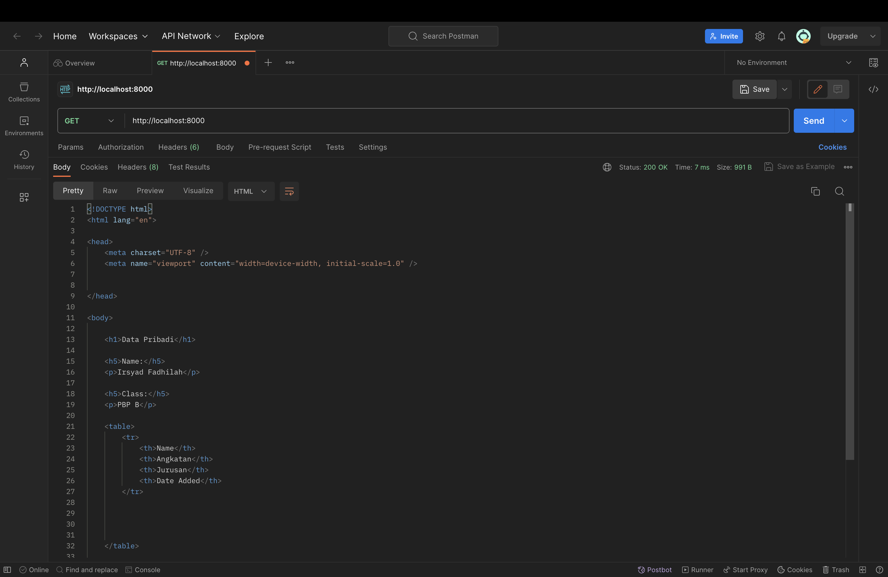
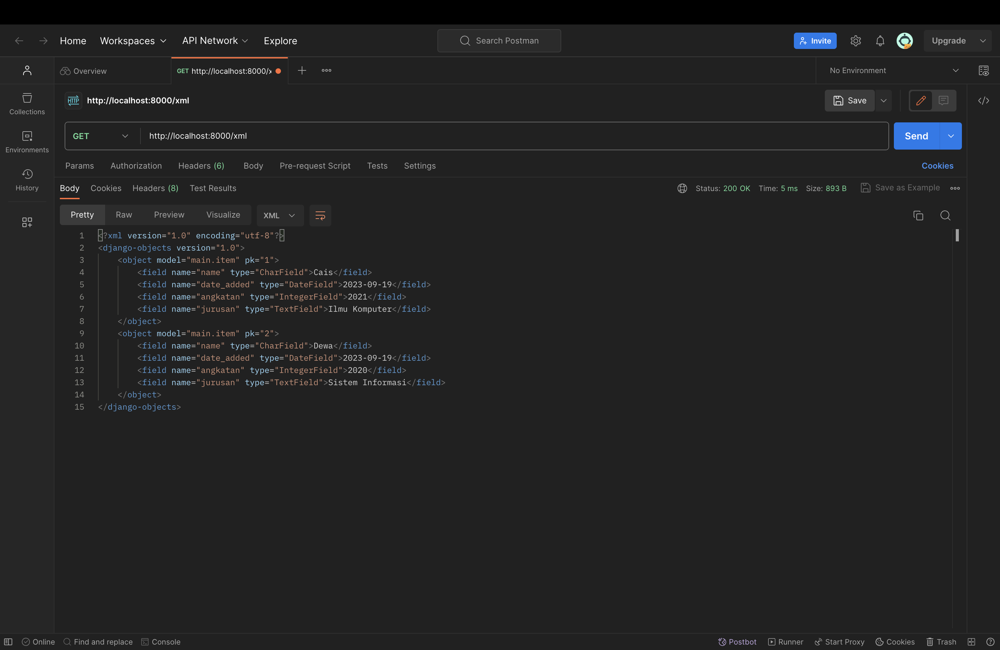
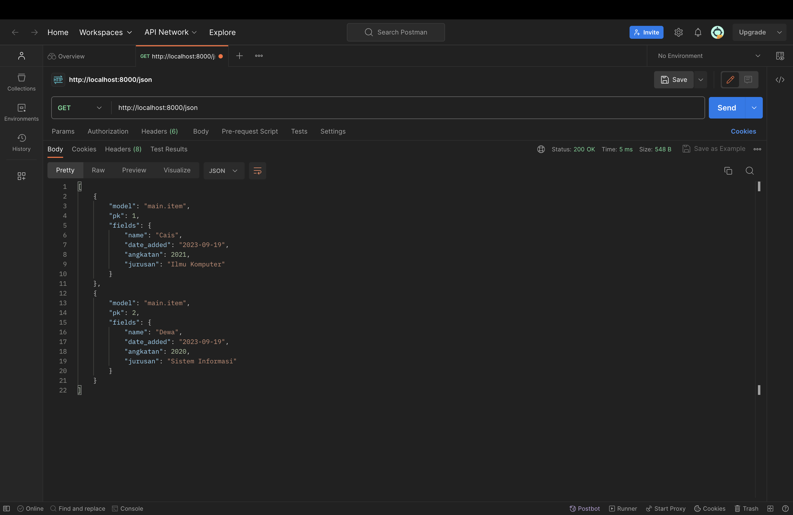

Tugas 2
Jelaskan mengapa kita menggunakan virtual environment? Apakah kita tetap dapat membuat aplikasi web berbasis Django tanpa menggunakan virtual environment?
Kita menggunakan virtual environment (venv atau virtualenv) dalam pengembangan perangkat lunak, termasuk aplikasi web berbasis Django, dengan beberapa alasan utama: 

Isolasi Proyek: Virtual environment memungkinkan Anda membuat lingkungan isolasi yang terpisah untuk setiap proyek. Ini berarti Anda dapat menginstal dependensi, paket Python, dan perpustakaan tertentu secara lokal untuk setiap proyek tanpa memengaruhi proyek lain. Hal ini sangat penting ketika Anda bekerja pada beberapa proyek yang menggunakan versi Python atau dependensi yang berbeda. 
Manajemen Dependensi: Virtual environment memungkinkan Anda mengelola dependensi proyek Anda dengan lebih baik. Anda dapat dengan mudah menginstal, mengupgrade, atau menghapus paket Python yang diperlukan secara lokal dalam lingkungan virtual tanpa mengganggu Python global yang ada di sistem Anda. Ini membantu mencegah konflik dependensi antar proyek. 
Reproduksibilitas: Dengan menggunakan virtual environment, Anda dapat membuat daftar dependensi yang jelas dan spesifik untuk proyek Anda dalam berkas seperti requirements.txt. Ini memungkinkan proyek Anda untuk direproduksi dengan mudah di lingkungan yang berbeda, sehingga memudahkan kolaborasi tim dan implementasi di server produksi. 
Kebersihan: Lingkungan virtual memastikan kebersihan dan kesederhanaan dalam mengelola proyek Anda. Saat Anda tidak menggunakan virtual environment, proyek Anda dapat dengan cepat menjadi kompleks karena banyaknya dependensi yang ada di level global. 
Kemudahan Pembaruan Python: Anda dapat mengupgrade atau mengganti versi Python di dalam virtual environment tanpa harus khawatir tentang memengaruhi sistem Python global Anda. Ini memungkinkan Anda untuk menjaga keamanan dan kestabilan sistem sambil tetap memperbarui versi Python sesuai kebutuhan proyek Anda. 

Apakah dapat membuat aplikasi web berbasis Django tanpa menggunakan virtual environment? Ya, masih bisa membuat aplikasi web berbasis Django tanpa virtual environment, tetapi tidak disarankan. Penggunaan virtual environment sangat dianjurkan untuk alasan-alasan yang telah dijelaskan di atas. Tanpa virtual environment, mungkin akan menghadapi masalah konflik dependensi antar proyek, kesulitan dalam manajemen proyek yang bersih, dan kesulitan dalam reproduksi proyek Anda di lingkungan yang berbeda. Oleh karena itu, sangat disarankan untuk selalu menggunakan virtual environment saat mengembangkan aplikasi web berbasis Django atau proyek Python lainnya.

Jelaskan apakah itu MVC, MVT, MVVM dan perbedaan dari ketiganya.
MVC (Model-View-Controller), MVT (Model-View-Template), dan MVVM (Model-View-ViewModel) adalah pola desain arsitektur perangkat lunak yang digunakan untuk mengorganisasi kode dalam aplikasi web dan desktop. Ini adalah konsep yang berbeda, meskipun ada beberapa kesamaan dalam cara mereka mengelola komponen-komponen utama dalam sebuah aplikasi. Berikut adalah penjelasan singkat tentang masing-masing dari mereka dan perbedaannya: 

MVC (Model-View-Controller): 
Model: Ini adalah komponen yang bertanggung jawab untuk mengelola data dan bisnis logic aplikasi. Model ini sering berinteraksi dengan basis data jika diperlukan. View: View adalah bagian yang mengatur presentasi data ke pengguna. Ini adalah antarmuka pengguna yang digunakan untuk berkomunikasi dengan pengguna akhir. Controller: Controller adalah bagian yang mengelola interaksi antara Model dan View. Ini mengatur alur kontrol aplikasi dan mengatur respons terhadap input pengguna. Perbedaan: Dalam MVC, Controller bertindak sebagai perantara antara Model dan View, dan View tidak memiliki pengetahuan tentang Model secara langsung. Controller mengontrol alur aplikasi. Pada dasarnya, MVC adalah pola arsitektur yang terpusat.

MVT (Model-View-Template): Model: Sama seperti dalam MVC, Model mengelola data dan bisnis logic. View: View adalah bagian yang bertanggung jawab untuk menampilkan data ke pengguna akhir. Template: Template adalah bagian yang mengatur tampilan halaman web dengan menggabungkan data dari Model ke dalam markup HTML. Ini mirip dengan View dalam MVC, tetapi dengan fokus pada halaman web. Perbedaan: MVT adalah pola yang digunakan khusus dalam kerangka kerja Django untuk pengembangan web. Dalam MVT, Template berperan sebagai bagian yang menampilkan data (mirip dengan View dalam MVC), sementara View berfungsi sebagai bagian yang mengelola logika aplikasi dan mengirimkan data dari Model ke Template. 

MVVM (Model-View-ViewModel): Model: Mirip dengan Model dalam MVC dan MVT, Model dalam MVVM mengelola data dan bisnis logic. View: View dalam MVVM adalah antarmuka pengguna yang menampilkan data dan mengirimkan perintah ke ViewModel. ViewModel: ViewModel adalah lapisan antara Model dan View. Ini mengambil data dari Model dan mempersiapkannya untuk ditampilkan dalam View. Ini juga menangani perintah dari View dan dapat mengubah data dalam Model jika diperlukan. Perbedaan: MVVM adalah pola yang sering digunakan dalam pengembangan aplikasi berbasis framework seperti Angular atau Vue.js. ViewModel memisahkan logika presentasi dari View, sehingga memungkinkan pengembang untuk menguji logika tampilan secara terpisah. Ini memfasilitasi pengikatan data dua arah, di mana perubahan dalam ViewModel secara otomatis diteruskan ke View dan sebaliknya. 

Singkatnya, MVC, MVT, dan MVVM adalah pola arsitektur yang berbeda dengan fokus dan peran yang berbeda dalam pengorganisasian kode dalam aplikasi. Pemilihan pola yang tepat tergantung pada jenis aplikasi yang Anda kembangkan dan teknologi yang Anda gunakan.

Langkah Langkah tahapan checklist :
Langkah 1: Membuat Proyek Django Baru Buka command prompt atau terminal, lalu jalankan perintah berikut untuk membuat proyek Django baru: bash Copy code django-admin startproject namaprojek Ini akan membuat direktori baru dengan nama proyek Django Anda. Anda dapat mengganti "namaprojek" dengan nama yang Anda inginkan. 
Langkah 2: Membuat Aplikasi "main" Masih di dalam direktori proyek Django Anda, jalankan perintah berikut untuk membuat aplikasi dengan nama "main": bash Copy code python manage.py startapp main Ini akan membuat direktori "main" dengan struktur aplikasi Django di dalamnya. 
Langkah 3: Routing pada Proyek Django Di dalam direktori proyek Anda, buka file urls.py yang berada dalam direktori proyek (bukan dalam direktori aplikasi). Tambahkan routing untuk aplikasi "main" di dalamnya: python Copy code from django.contrib import admin from django.urls import path, include urlpatterns = [ path('admin/', admin.site.urls), path('main/', include('main.urls')), # Menambahkan routing untuk aplikasi "main" ] 
Langkah 4: Membuat Model "Item" Di dalam direktori aplikasi "main", buka file models.py dan buat model "Item" seperti yang Anda sebutkan dalam checklist: python Copy code from django.db import models class Item(models.Model): name = models.CharField(max_length=100) amount = models.IntegerField() description = models.TextField() 
Langkah 5: Membuat Fungsi pada views.py Di dalam direktori aplikasi "main", buka file views.py dan buat sebuah fungsi yang akan mengembalikan data ke dalam sebuah template HTML: python Copy code from django.shortcuts import render def home(request): return render(request, 'main/home.html', {'app_name': 'Nama Aplikasi', 'nama_kelas': 'Kelas Anda'})
Langkah 6: Membuat Template HTML Di dalam direktori aplikasi "main", buat sebuah direktori bernama "templates" (jika belum ada) dan di dalamnya buat subdirektori "main". Di dalam direktori "main", buat file HTML dengan nama "home.html". Isi file ini dengan HTML yang Anda inginkan, dan Anda dapat menggunakan variabel app_name dan nama_kelas yang dikirimkan melalui render(). 
Langkah 7: Membuat Routing pada urls.py Aplikasi "main" Di dalam direktori aplikasi "main", buka file urls.py dan buat routing untuk fungsi yang telah Anda buat di views.py: python Copy code from django.urls import path from . import views urlpatterns = [ path('', views.home, name='home'), ] 
Langkah 8: Deployment ke Adaptable Untuk melakukan deployment ke Adaptable (atau platform hosting lainnya), Anda perlu mengikuti panduan atau dokumentasi dari platform tersebut karena setiap platform memiliki proses deployment yang berbeda. Biasanya, Anda perlu mengatur server, database, dan mengunggah kode proyek Anda ke server. 
Langkah 9: Membuat README.md Buatlah berkas README.md yang berisi informasi tentang tautan ke aplikasi Adaptable yang sudah di-deploy dan jawaban atas beberapa pertanyaan yang diberikan dalam checklist tugas Anda. Jangan lupa untuk menjalankan migrasi database menggunakan python manage.py makemigrations dan python manage.py migrate setelah membuat model "Item". Semua langkah-langkah di atas harus dijalankan secara berurutan untuk membuat dan mengimplementasikan proyek Django Anda sesuai dengan checklist tugas yang Anda sebutkan. Pastikan Anda telah mengonfigurasi database, setting proyek, dan hal-hal lain yang mungkin diperlukan sesuai dengan kebutuhan proyek Anda.

Tugas 3 PBP
1. Dalam Django, seperti dalam banyak kerangka kerja web lainnya, Anda dapat menggunakan metode HTTP POST dan GET untuk mengirim data dari formulir HTML ke server. Berikut adalah perbedaan utama antara keduanya: 
- Metode Pengiriman Data: Dalam form POST, data yang dikirimkan ke server dimasukkan dalam tubuh permintaan HTTP. Oleh karena itu, data tersebut tidak terlihat dalam URL dan dianggap lebih aman untuk mengirim data sensitif seperti kata sandi. Dalam form GET, data yang dikirimkan ke server dimasukkan dalam URL sebagai parameter query string. Ini membuat data dapat dilihat dalam URL, dan metode GET lebih baik digunakan untuk permintaan yang bersifat idempoten, seperti pencarian atau penampilan halaman. 
Batasan Ukuran Data: Tidak ada batasan ukuran data yang ketat dalam form POST, sehingga Anda dapat mengirimkan volume data yang lebih besar melalui metode ini. Terdapat batasan ukuran URL yang lebih ketat dalam form GET. Browsers umumnya memiliki batasan panjang URL, dan server juga dapat membatasi ukuran URL yang diterimanya. Oleh karena itu, metode GET sebaiknya digunakan untuk data yang relatif kecil. 
- Bookmarking dan Kepala Riwayat: Karena data dikirimkan dalam tubuh permintaan HTTP, metode POST tidak memungkinkan bookmarking atau penambahan ke dalam riwayat browser secara langsung. Anda tidak dapat dengan mudah menambahkan tautan ke hasil pencarian atau formulir POST ke bookmark. Kemudian untuk GET, Karena data dikirimkan melalui URL, metode GET memungkinkan bookmarking dan penambahan ke dalam riwayat browser. Ini membuatnya cocok untuk pencarian dan tautan ke halaman yang ingin Anda bagikan atau bookmark. 
- Keamanan: Karena data tidak terlihat dalam URL, form POST cenderung lebih aman untuk mengirim data sensitif. Namun, Anda masih perlu melindungi form POST dari serangan CSRF (Cross-Site Request Forgery) dengan menggunakan mekanisme perlindungan yang disediakan oleh Django. Sedangkan Data dalam form GET terlihat dalam URL dan dapat dengan mudah disadap. Ini membuatnya kurang aman untuk data sensitif. Selain itu, data dalam form GET juga dapat muncul dalam log server atau log akses web, yang bisa menjadi masalah keamanan. 
2. XML (Extensible Markup Language), JSON (JavaScript Object Notation), dan HTML (Hypertext Markup Language) adalah tiga format yang umum digunakan untuk mengirim data di berbagai konteks. Berikut adalah perbedaan utama antara ketiganya dalam konteks pengiriman data: 
- Struktur Data: XML adalah bahasa markup yang sangat fleksibel yang digunakan untuk mewakili data dalam format hierarki berbasis teks. Data dalam XML dijelaskan menggunakan tag-tag yang dapat disesuaikan, sehingga XML lebih cocok untuk mewakili data yang kompleks dan bervariasi. JSON adalah format data ringkas yang berbasis teks dan digunakan untuk mewakili objek dan array. Ini memiliki struktur data yang lebih sederhana daripada XML dan sangat cocok untuk data yang memiliki struktur yang lebih sederhana, seperti objek dan daftar atribut-nilai. HTML adalah bahasa markup yang digunakan untuk membuat konten web. Ini memiliki struktur yang lebih terbatas dibandingkan dengan XML atau JSON, karena tujuannya adalah untuk menggambarkan tampilan halaman web, bukan data mentah. 
- Ketelitian Pada Tipe Data: XML mendukung tipe data yang lebih kaya dan dapat mendefinisikan tipe data khusus melalui Document Type Definition (DTD) atau XML Schema. Ini membuatnya lebih kuat dalam hal validasi data. JSON memiliki tipe data yang lebih terbatas dibandingkan dengan XML. Ini hanya mendukung tipe data dasar seperti string, angka, boolean, objek, dan array. Namun, ini membuat JSON lebih mudah digunakan dan lebih ringkas untuk data sederhana. HTML tidak fokus pada tipe data dalam konteks pengiriman data. Tujuannya adalah untuk menggambarkan struktur dan tampilan konten web. 
- Bacaan dan Penulisan: XML sering kali memerlukan lebih banyak karakter untuk menggambarkan data yang sama dibandingkan dengan JSON. Ini membuat XML cenderung lebih besar dan lebih lambat dalam pengiriman dan pemrosesan data. JSON memiliki format yang lebih ringkas, sehingga memerlukan lebih sedikit karakter untuk menggambarkan data. Ini membuatnya lebih efisien dalam hal pengiriman dan pemrosesan data. HTML juga memiliki format yang cukup ringkas, tetapi tujuannya adalah untuk menampilkan konten web, bukan mengirimkan data mentah. 
- Kompatibilitas dengan Bahasa: XML mendukung banyak bahasa pemrograman dan memiliki dukungan yang luas dalam berbagai platform. Kemudian JSON berasal dari JavaScript dan secara alami kompatibel dengan JavaScript, tetapi juga memiliki dukungan yang baik di banyak bahasa pemrograman lainnya. Lalu HTML adalah bahasa markup khusus untuk web, dan banyak bahasa pemrograman memiliki dukungan untuk memanipulasi dan mengurai HTML.
3. JSON (JavaScript Object Notation) sering digunakan dalam pertukaran data antara aplikasi web modern karena memiliki beberapa keunggulan yang membuatnya format yang populer dan efisien, berikut alasan-alasannya : 
- Ringkas: JSON adalah format yang ringkas, artinya data dapat direpresentasikan dengan jumlah karakter yang lebih sedikit dibandingkan dengan format lain seperti XML. Ini membuatnya lebih efisien dalam hal penggunaan bandwidth dan transfer data melalui jaringan. 
- Mudah Dibaca dan Ditulis: JSON menggunakan struktur objek dan daftar yang sangat mirip dengan format data dalam banyak bahasa pemrograman. Ini membuatnya mudah dibaca dan ditulis oleh manusia dan aplikasi. Bahkan, JSON berasal dari JavaScript, sehingga kompatibel secara alami dengan banyak bahasa pemrograman, termasuk JavaScript, Python, Java, dan banyak lainnya. 
- Partial Parsing: JSON memungkinkan parsing parsial, yang berarti Anda dapat dengan mudah mengakses bagian tertentu dari data tanpa harus mengurai seluruh dokumen. Ini sangat berguna dalam aplikasi web modern yang sering kali membutuhkan pertukaran data dalam format yang dapat diambil secara dinamis saat dibutuhkan. 
- Kompatibilitas Cross-Platform: JSON dapat digunakan secara lintas platform dan bahasa pemrograman. Ini memungkinkan berbagai sistem dan aplikasi yang berbeda untuk berkomunikasi dengan mudah dan saling berinteraksi. 
- Penggunaan dalam JavaScript: JSON secara alami cocok dengan JavaScript karena formatnya sangat mirip dengan objek JavaScript. Oleh karena itu, JSON sangat umum digunakan dalam pengiriman data antara server dan klien web (browser) yang berbasis JavaScript. 
- Keamanan: JSON lebih aman daripada format data yang lebih kompleks seperti XML, karena tidak memiliki fitur-fitur seperti dukungan untuk dokumen DTD (Document Type Definition) yang bisa dimanfaatkan oleh penyerang untuk serangan seperti XML External Entity (XXE) injection. 
- Kemudahan Debugging: JSON memiliki format yang jelas dan mudah dibaca oleh manusia, yang memudahkan debugging dan pemecahan masalah dalam pertukaran data. 
Karena keunggulan-keunggulannya ini, JSON telah menjadi format data yang sangat populer dalam pengembangan aplikasi web modern, terutama dalam komunikasi antara aplikasi klien dan server. Namun, penting untuk diingat bahwa pemilihan format data juga harus mempertimbangkan kebutuhan dan karakteristik khusus dari aplikasi Anda.
4. Berikut merupakan tahapan yang saya lakukan untuk membuat tugas 3
Panduan Mengatur Routing dari main/ ke / 
- Ubah routing dari main/ menjadi / pada berkas urls.py. 
- Jalankan virtual environment terlebih dahulu. 
- Buka urls.py dan ubah path sesuai dengan perubahan routing. 
- Jalankan server dengan python manage.py runserver dan buka http://localhost:8000/ di browser. 
- Implementasi Skeleton sebagai Kerangka Views : Buat folder templates dan buat berkas base.html sebagai template dasar. 
- Isi base.html dengan kode template dasar. 
- Sesuaikan konfigurasi settings.py agar berkas base.html terdeteksi sebagai template. 
- Ubah berkas main.html untuk menggunakan base.html sebagai template utama. 
- Membuat Form Input Data dan Menampilkan Data Produk Pada HTML : Buat berkas forms.py untuk membuat form input data produk. 
- Buat fungsi create_product untuk menangani form input data produk. 
- Ubah fungsi show_main untuk menampilkan data produk. 
- Tambahkan URL path untuk create_product. 
- Buat berkas create_product.html untuk tampilan form input produk. Mengembalikan Data dalam Bentuk XML dan JSON : Buat fungsi show_xml dan show_json untuk mengembalikan data dalam format XML dan JSON. 
- Tambahkan URL path untuk show_xml dan show_json. 
- Mengembalikan Data Berdasarkan ID dalam Bentuk XML dan JSON : Buat fungsi show_xml_by_id dan show_json_by_id untuk mengembalikan data produk berdasarkan ID dalam format XML dan JSON. 
- Tambahkan URL path untuk show_xml_by_id dan show_json_by_id. 
- Penggunaan Postman Sebagai Data Viewer Pastikan server berjalan (python manage.py runserver). : Buka Postman dan buat request GET dengan URL sesuai kebutuhan (XML atau JSON). 
- Klik tombol Send untuk mengirimkan request. 
- Lihat hasil response dari request pada Postman. 

TUGAS 4 PBP :

1. Django UserCreationForm adalah sebuah formulir yang disediakan oleh Django, sebuah framework web Python yang populer, untuk memudahkan proses pembuatan akun pengguna (user) dalam aplikasi web. Formulir ini dirancang khusus untuk mengumpulkan informasi yang diperlukan untuk membuat akun pengguna baru, seperti nama pengguna (username), kata sandi (password), dan konfirmasi kata sandi (password confirmation). UserCreationForm adalah bagian dari modul django.contrib.auth.forms dan dapat digunakan dengan mudah dalam pengembangan aplikasi web Django yang melibatkan otentikasi pengguna.

Kelebihan dari Django UserCreationForm:

- Mudah digunakan: UserCreationForm sudah disediakan oleh Django dan telah dikonfigurasi secara default. Ini membuatnya sangat mudah digunakan tanpa perlu menulis kode tambahan untuk membuat formulir pendaftaran pengguna.

- Validasi otomatis: Formulir ini melakukan validasi otomatis terhadap berbagai aspek, seperti kekuatan kata sandi, konfirmasi kata sandi yang sesuai, dan pengecekan apakah nama pengguna sudah ada atau belum.

- Integrasi dengan Django Authentication: UserCreationForm terintegrasi dengan baik dengan sistem otentikasi Django. Setelah pengguna mendaftar, akun mereka akan disimpan dalam database dengan aman, dan mereka dapat masuk ke aplikasi menggunakan Django's authentication system.

- Dukungan untuk Customisasi: Meskipun formulir ini sudah terkonfigurasi dengan baik secara default, Anda masih bisa menyesuaikannya sesuai dengan kebutuhan aplikasi Anda dengan menambahkan atribut atau menyesuaikan validasi.

Kekurangan dari Django UserCreationForm:

- Terbatas pada pembuatan akun pengguna: UserCreationForm terutama digunakan untuk pembuatan akun pengguna. Jika Anda memerlukan formulir dengan fitur lebih lanjut, seperti pengumpulan data tambahan saat pendaftaran, Anda mungkin perlu membuat formulir khusus sendiri.

- Tampilan default yang sederhana: Tampilan formulir ini sederhana dan mungkin perlu disesuaikan secara manual jika Anda ingin menambahkan elemen desain atau tampilan yang lebih kompleks.

- Tidak termasuk semua fitur tambahan: Beberapa fitur tambahan, seperti konfirmasi email atau captcha, mungkin perlu ditambahkan secara manual jika dibutuhkan.

- Ketergantungan pada Django: Jika Anda memutuskan untuk menggunakan framework web lain atau ingin memindahkan aplikasi Anda dari Django ke platform lain, Anda mungkin perlu menulis ulang sebagian besar logika pendaftaran pengguna Anda.

2. Dalam konteks Django, autentikasi dan otorisasi adalah dua konsep penting yang berperan dalam mengelola akses dan keamanan dalam aplikasi web. Meskipun keduanya terkait erat, mereka memiliki perbedaan yang jelas dalam fungsi dan tujuan:

- Autentikasi (Authentication):

Definisi: Autentikasi adalah proses verifikasi identitas pengguna. Ini adalah langkah pertama yang dilakukan saat seorang pengguna mencoba untuk mengakses suatu sumber daya atau sistem. Tujuannya adalah untuk memastikan bahwa pengguna adalah siapa yang mereka klaim menjadi, misalnya, memasukkan nama pengguna (username) dan kata sandi (password) untuk masuk ke akun mereka.
Pentingnya: Autentikasi diperlukan untuk memastikan bahwa hanya pengguna yang sah yang memiliki akses ke sumber daya atau fitur tertentu dalam aplikasi web. Dengan autentikasi yang kuat, Anda dapat memastikan bahwa hanya pengguna yang telah mendaftar dan memiliki hak akses yang tepat yang dapat menggunakan fitur aplikasi Anda.

- Otorisasi (Authorization):

Definisi: Otorisasi adalah proses yang terjadi setelah autentikasi. Ini menentukan hak akses dan izin apa yang dimiliki oleh pengguna yang telah terotentikasi. Ini berarti menjawab pertanyaan seperti "Pengguna A dapatkah mengakses sumber daya X atau melakukan tindakan Y?"
Pentingnya: Otorisasi membantu mengendalikan apa yang dapat dilakukan oleh pengguna yang telah terotentikasi dalam aplikasi. Ini memastikan bahwa meskipun pengguna telah masuk, mereka hanya dapat mengakses sumber daya atau fitur yang sesuai dengan peran atau izin mereka. Ini adalah langkah kunci dalam menjaga keamanan dan privasi data dalam aplikasi.

Kesimpulannya, autentikasi dan otorisasi adalah dua langkah kunci dalam mengelola akses dan keamanan dalam aplikasi web. Autentikasi memastikan bahwa pengguna adalah mereka yang mereka klaim menjadi, sementara otorisasi menentukan apa yang dapat dilakukan oleh pengguna yang telah terotentikasi. Keduanya penting karena kombinasi dari keduanya memastikan bahwa hanya pengguna yang sah dan berwenang yang dapat menggunakan fitur dan sumber daya dalam aplikasi, menjaga keamanan dan privasi data. Dalam Django, sistem otentikasi dan otorisasi yang kuat telah terintegrasi dengan baik, memudahkan pengembang untuk mengelola kedua aspek ini dalam aplikasi mereka.

3. Cookies adalah salah satu mekanisme yang digunakan dalam aplikasi web untuk menyimpan informasi sederhana di sisi klien (browser) agar dapat diakses dan digunakan oleh server web. Cookies umumnya digunakan untuk menyimpan data sesi, informasi pengguna, preferensi, dan sebagainya. Dalam konteks Django, cookies sering digunakan untuk mengelola data sesi pengguna.

Berikut adalah beberapa konsep dasar terkait cookies dalam konteks aplikasi web:

Cookies: Cookies adalah data kecil yang disimpan di sisi klien (browser) dan dikirimkan kembali ke server web setiap kali permintaan HTTP dikirimkan ke server tersebut. Cookies biasanya terdiri dari nama, nilai, dan beberapa atribut opsional lainnya.

Data Sesi (Session Data): Data sesi adalah informasi yang ingin disimpan dan diakses selama satu sesi pengguna. Sesuai dengan konsep sesi web, sesi dimulai ketika pengguna masuk ke situs web dan berakhir ketika pengguna keluar atau sesi kadaluwarsa.

Django Session Framework: Django memiliki framework sesi yang kuat yang memungkinkan Anda untuk mengelola data sesi pengguna dengan mudah. Django menggunakan cookies untuk mengidentifikasi sesi pengguna. Setiap kali pengguna mengakses situs web, Django akan mengirimkan sebuah cookie yang berisi ID sesi unik ke browser pengguna.

Cara Django menggunakan cookies untuk mengelola data sesi pengguna:

- Pengaturan Sesi: Di dalam pengaturan Django (settings.py), Anda dapat mengonfigurasi berbagai parameter terkait sesi, termasuk jenis penyimpanan yang akan digunakan (seperti database atau cache) dan berapa lama sesi akan bertahan.

- Penyimpanan ID Sesi: Ketika pengguna pertama kali mengunjungi situs web, Django akan membuat ID sesi unik dan menyimpannya dalam cookie di sisi klien. Setiap kali pengguna melakukan permintaan berikutnya, ID sesi ini akan disertakan dalam permintaan HTTP.

- Penyimpanan Data Sesi: Data sesi pengguna (seperti informasi login, keranjang belanja, atau preferensi) dapat disimpan dalam penyimpanan yang telah dikonfigurasi (database atau cache) dengan menggunakan ID sesi sebagai kunci. Django akan mengatur semua ini secara otomatis.

- Akses Data Sesi: Di dalam kode aplikasi Anda, Anda dapat mengakses data sesi pengguna dengan menggunakan objek request.session. Ini memungkinkan Anda untuk menyimpan, mengambil, atau menghapus data sesi sesuai dengan kebutuhan aplikasi Anda.

- Keamanan: Django secara otomatis mengatur penggunaan cookies sesi dengan aman, termasuk mengenkripsi data sesi agar tidak dapat diubah oleh klien.

Dengan menggunakan mekanisme cookies dan framework sesi Django, pengembang dapat dengan mudah mengelola data sesi pengguna, mengidentifikasi pengguna yang telah masuk, dan menyimpan informasi yang diperlukan untuk interaksi selama satu sesi pengguna. Ini memungkinkan pembuatan aplikasi web yang lebih interaktif dan personal.

4. Penggunaan cookies dalam pengembangan web dapat menjadi aman jika diimplementasikan dengan benar, tetapi juga dapat memiliki risiko potensial jika tidak diatur dengan hati-hati. Berikut adalah beberapa risiko potensial yang harus diwaspadai ketika menggunakan cookies:

- Pencurian Data: Jika cookies mengandung data sensitif, seperti informasi login atau sesi, dan tidak dienkripsi dengan baik, mereka dapat menjadi target pencurian data oleh penyerang. Penyerang yang berhasil mencuri cookies tersebut dapat mengakses akun pengguna atau informasi pribadi.

- Cookie Hijacking: Penyerang juga dapat mencoba mencuri cookies pengguna dengan menggunakan teknik seperti session hijacking atau man-in-the-middle attacks. Ini dapat mengakibatkan sesi pengguna diretas atau disusupi.

- Cross-Site Scripting (XSS): Jika aplikasi Anda rentan terhadap serangan XSS, penyerang dapat memasukkan skrip jahat ke dalam halaman web yang akan dieksekusi oleh browser pengguna. Dalam konteks cookies, ini dapat digunakan untuk mencuri cookies pengguna.

- Cross-Site Request Forgery (CSRF): Serangan CSRF dapat memaksa pengguna yang sudah terotentikasi untuk melakukan tindakan yang tidak disengaja di situs web tertentu, termasuk tindakan yang melibatkan cookies, seperti mengganti kata sandi.

- Cookie Sniffing: Penyerang dapat mencoba untuk mencuri cookies dengan menggunakan teknik sniffing pada jaringan yang tidak aman. Ini bisa terjadi jika lalu lintas web tidak dienkripsi dengan protokol HTTPS.

Untuk mengurangi risiko potensial ini, berikut adalah beberapa praktik yang harus diperhatikan dalam penggunaan cookies yang aman:

- Enkripsi: Pastikan cookies yang mengandung data sensitif dienkripsi dengan benar, terutama jika berisi informasi otentikasi atau sesi.

- Secured Flag: Penggunaan Secure flag dalam cookie memastikan bahwa cookie hanya akan dikirim melalui koneksi HTTPS yang aman.

- HttpOnly Flag: Mengatur HttpOnly flag pada cookies yang berisi data sesi akan mencegah mereka diakses melalui JavaScript, mengurangi risiko serangan XSS.

dan masih banyak cara-cara lain untuk mengantisipasi risiko potensial.

5. Berikut Tahapan untuk menyelesaikan Checklist :
- Jalankan virtual environment.
- Buka views.py di subdirektori main dan buat fungsi register.
- Impor redirect, UserCreationForm, dan messages ke dalam views.py.
- Tambahkan kode untuk membuat formulir pendaftaran pengguna (UserCreationForm) dan mengelola pendaftaran pengguna.
- Buat berkas HTML baru bernama register.html di folder main/templates dan isi dengan formulir pendaftaran.
- Buka urls.py di subdirektori main dan impor fungsi register.
- Tambahkan path URL untuk mengakses fungsi pendaftaran.
- Buat fungsi login_user untuk menangani proses login pengguna.
- Impor authenticate dan login ke dalam views.py.
- Tambahkan kode untuk mengautentikasi pengguna saat login.
- Buat berkas HTML baru bernama login.html di folder main/templates dan isi dengan formulir login.
- Buka urls.py di subdirektori main dan impor fungsi login_user.
- Tambahkan path URL untuk mengakses fungsi login.
- Buat fungsi logout_user untuk menangani proses logout pengguna.
- Impor logout ke dalam views.py.
- Tambahkan kode untuk melakukan logout dan menghapus cookie saat logout.
- Buka urls.py di subdirektori main dan impor fungsi logout_user.
- Tambahkan path URL untuk mengakses fungsi logout.
- Buat fungsi show_main dan tambahkan dekorator @login_required untuk membatasi akses ke halaman utama hanya untuk pengguna yang sudah login.
- Impor login_required ke dalam views.py.
- Buka berkas main.html dan tambahkan tombol logout.
- Buat fungsi untuk menghubungkan model Product dengan pengguna.
- Impor User ke dalam models.py.
- Tambahkan field user yang merupakan ForeignKey pada model Product untuk menghubungkan setiap produk dengan pengguna yang membuatnya.
- Ubah fungsi create_product untuk menghubungkan produk yang dibuat dengan pengguna yang sedang login.
- Ubah fungsi show_main untuk hanya menampilkan produk yang dimiliki oleh pengguna yang sedang login.
- Buat migrasi model dan terapkan migrasi.
- Jalankan proyek Django dan coba membuat akun baru, login, dan lihat bagaimana produk hanya ditampilkan untuk pengguna yang membuatnya

TUGAS 5 PBP :

1. Element selector adalah salah satu jenis selektor dalam CSS yang digunakan untuk menggambarkan tampilan dan gaya elemen HTML berdasarkan jenis elemennya. Setiap elemen HTML memiliki nama khusus, seperti <"p">, <"h1">, <"div">, dan lain sebagainya. Di bawah ini, saya akan menjelaskan manfaat dari beberapa jenis selektor elemen dan kapan waktu yang tepat untuk menggunakannya:
- Type Selector (Element Selector) . Manfaatnya yaitu Selector elemen memungkinkan Anda menggambarkan tampilan dan gaya khusus untuk jenis elemen tertentu, seperti <"p">, <"h1">, atau <"div">. Ini membantu dalam memastikan konsistensi tampilan elemen di seluruh halaman. Kapan Menggunakannya yaitu Digunakan ketika Anda ingin menggambarkan tampilan khusus untuk satu atau beberapa jenis elemen dalam dokumen.
- ID Selector (#id). Manfaat ID selector memungkinkan Anda menentukan gaya yang unik untuk elemen dengan atribut ID tertentu. Ini berguna ketika Anda memiliki elemen dengan ID unik yang perlu diubah tampilannya. Kapan Menggunakannya yaitu Idealnya, digunakan ketika Anda memiliki elemen dengan atribut ID yang unik dalam halaman web Anda.
- Class Selector (.class). Manfaat Class selector memungkinkan Anda menggambarkan tampilan yang sama atau serupa untuk beberapa elemen dengan atribut class yang sama. Ini memungkinkan Anda untuk menerapkan gaya yang konsisten pada elemen-elemen yang berbagi atribut class yang sama. Kapan Menggunakannya yaitu Cocok digunakan ketika Anda memiliki beberapa elemen yang ingin Anda gayakan dengan cara yang serupa, tetapi mungkin ada elemen lain dengan gaya yang berbeda.
- Universal Selector (*). Manfaat Universal selector memungkinkan Anda memengaruhi semua elemen dalam halaman web, baik elemen-elemen yang ada maupun yang akan ditambahkan di masa depan. Ini dapat digunakan untuk mengatur properti dasar seperti padding dan margin secara konsisten di seluruh halaman. Kapan Menggunakannya yaitu Gunakan dengan hati-hati karena dapat berpengaruh besar pada kinerja. Sebaiknya digunakan secara terbatas, seperti untuk mengatur nilai dasar font atau margin.

2. HTML5 (Hypertext Markup Language 5) merupakan versi terbaru dari bahasa markup yang digunakan untuk membuat Website. HTML5 memiliki berbagai tag (elemen) yang digunakan untuk membangun struktur dan konten halaman web. Di bawah ini adalah beberapa tag HTML5 yang umum digunakan:

- <"html"> : Tag ini digunakan untuk mengawali dokumen HTML. Semua elemen HTML ditempatkan di dalamnya.

- <"head"> : Elemen ini berisi informasi tentang dokumen HTML, seperti judul halaman, meta-informasi, dan tautan ke stylesheet dan skrip JavaScript.

- <"title"> : Digunakan untuk menentukan judul halaman yang akan ditampilkan di bilah judul browser.

- <"meta"> : Elemen ini digunakan untuk menyisipkan meta-informasi ke dalam halaman web, seperti karakter encoding, deskripsi, dan instruksi pengindeksan.

- <"link"> : Digunakan untuk menghubungkan halaman web dengan stylesheet eksternal atau sumber daya lainnya.

- <"style"> : Elemen ini digunakan untuk mendefinisikan gaya (CSS) secara internal di dalam dokumen HTML.

- <"script">: Elemen ini digunakan untuk menyisipkan kode JavaScript ke dalam halaman web.

- <"body">: Bagian utama dari halaman web yang berisi konten yang akan ditampilkan kepada pengguna.

- <"header">: Digunakan untuk mendefinisikan bagian kepala halaman, yang sering berisi logo, judul, dan elemen-elemen terkait lainnya.

- <"nav">: Elemen ini digunakan untuk mendefinisikan bagian navigasi, seperti menu situs web.

- <"main"> : Menandakan konten utama dari halaman web, dan hanya boleh digunakan satu kali dalam satu halaman.

- <"section"> : Digunakan untuk membagi halaman web menjadi bagian-bagian yang berbeda dengan tujuan khusus.

- <"article"> : Elemen ini digunakan untuk menandakan konten independen, seperti berita, blog post, atau artikel.

- <"aside"> : Digunakan untuk menandakan konten yang berhubungan dengan konten utama, tetapi tidak terlalu penting, seperti sidebar.

- <"footer"> : Bagian bawah dari halaman web yang sering berisi informasi tambahan, tautan, atau hak cipta.

- <"p">: Digunakan untuk menandai paragraf teks.

- <"a">: Elemen ini digunakan untuk membuat tautan (link) ke halaman web lain atau sumber daya.

- <"img">: Digunakan untuk menyisipkan gambar ke dalam halaman web.

- <"ul">, <"ol">, dan <"li">: Elemen ini digunakan untuk membuat daftar tak terurut (unordered list) dan daftar terurut (ordered list) dengan item-list (<"li">).

- <"table">, <"tr">, <"td">, dan <"th">: Elemen ini digunakan untuk membuat tabel dan mengatur data dalam sel-sel tabel.

- <"form">, <"input">, dan <"button">: Digunakan untuk membuat formulir yang memungkinkan pengguna untuk mengirimkan data ke server

3. Margin dan padding adalah dua properti dalam CSS yang digunakan untuk mengatur tata letak elemen-elemen dalam halaman web. Mereka memiliki perbedaan yang penting dalam cara mereka memengaruhi tata letak elemen dan interaksi dengan elemen-elemen lain di sekitarnya:
Margin:
- Margin adalah ruang luar elemen: Margin adalah jarak antara batas luar elemen (border elemen) dan elemen-elemen lain di sekitarnya.
- Mengatur margin memengaruhi jarak antara elemen dengan elemen lain: Mengatur margin akan mempengaruhi seberapa jauh elemen tersebut dari elemen-elemen lain di sekitarnya.
- Margin tidak berwarna atau transparan: Margin tidak memiliki warna atau latar belakang dan biasanya digunakan untuk mengatur jarak antara elemen-elemen.

Padding:
- Padding adalah ruang dalam elemen: Padding adalah jarak antara batas dalam elemen (border elemen) dan konten yang ada di dalam elemen tersebut.
- Mengatur padding memengaruhi ruang di dalam elemen: Mengatur padding akan mempengaruhi seberapa jauh konten dalam elemen tersebut dari batas dalam elemen.
- Padding dapat memiliki warna atau latar belakang: Anda dapat memberi warna atau latar belakang pada padding, sehingga akan mempengaruhi tampilan elemen dan area di dalamnya. 

4. Tailwind CSS dan Bootstrap adalah dua framework CSS yang populer digunakan untuk membangun tampilan web. Mereka memiliki pendekatan dan karakteristik yang berbeda, dan pemilihan antara keduanya tergantung pada kebutuhan proyek dan preferensi pengembang. Berikut perbedaan utama antara keduanya dan kapan sebaiknya menggunakan satu daripada yang lain:

Tailwind CSS:

- Utility-First Approach: Tailwind CSS mengikuti pendekatan "utility-first," yang berarti framework ini memberikan banyak kelas utilitas yang dapat digunakan untuk langsung mengatur tampilan elemen-elemen HTML. Anda mengkombinasikan kelas-kelas ini untuk membuat tampilan yang sesuai dengan kebutuhan.

- Customizable: Tailwind sangat dapat disesuaikan. Anda dapat mengonfigurasi desain, mengubah warna, ukuran, dan bahkan menambahkan kelas utilitas kustom sesuai kebutuhan proyek.

- Minimal Styling: Tailwind tidak memiliki banyak gaya bawaan. Ini memungkinkan Anda untuk memiliki lebih sedikit kode CSS yang tidak terpakai, yang berarti proyek Anda mungkin lebih ringan.

- Kontrol yang Lebih Besar: Anda memiliki kontrol yang lebih besar atas tampilan elemen-elemen Anda, tetapi juga memerlukan lebih banyak kerja dan pemikiran dalam menggabungkan kelas-kelas utilitas.

Kapan sebaiknya menggunakan Tailwind CSS:

- Ketika Anda ingin kontrol yang sangat detail atas tampilan elemen-elemen Anda.
- Jika Anda ingin menghindari penggunaan gaya bawaan yang berlebihan dan mengurangi pemborosan.
- Jika Anda suka pendekatan "utility-first" dan senang bekerja dengan kelas-kelas utilitas.

Bootstrap:

- Component-Based: Bootstrap adalah framework CSS berbasis komponen, yang berarti itu menyediakan komponen-komponen yang telah dirancang sebelumnya seperti navigasi, formulir, jumbotron, dll. Anda hanya perlu menerapkan kelas-kelas Bootstrap untuk menggunakan komponen-komponen ini.

- Rapid Development: Dengan Bootstrap, Anda dapat membangun tampilan web dengan cepat karena komponen-komponennya telah dirancang dan terbukti digunakan dalam banyak proyek.

- Consistency: Bootstrap memberikan konsistensi tampilan dan pengalaman pengguna di seluruh proyek karena menggunakan gaya baku.

- Kustomisasi yang Dibatasi: Sementara Bootstrap dapat disesuaikan, dalam beberapa kasus, mengubah tampilan komponen atau gaya bawaannya bisa sulit dan memerlukan penyesuaian yang lebih besar.

Kapan sebaiknya menggunakan Bootstrap:

- Ketika Anda perlu membangun situs web dengan cepat dan Anda menghargai komponen-komponen yang telah dirancang sebelumnya.
- Jika Anda ingin memastikan konsistensi dalam tampilan dan pengalaman pengguna di seluruh proyek Anda.
- Jika Anda tidak ingin menghabiskan banyak waktu untuk menyesuaikan tampilan.

Pilihan antara Tailwind CSS dan Bootstrap tergantung pada prioritas dan kebutuhan proyek Anda. Jika Anda mengutamakan kontrol yang lebih besar dan siap bekerja dengan pendekatan "utility-first," maka Tailwind bisa menjadi pilihan yang baik. Di sisi lain, jika Anda ingin membangun proyek dengan cepat dan menghargai komponen-komponen yang telah dirancang sebelumnya, Bootstrap bisa menjadi pilihan yang lebih sesuai.

5. Berikut inti bagaimana cara saya mengimplementasikan checklist di atas secara step-by-step :
berikut tahapan berurut:

**Menambahkan Bootstrap ke Aplikasi:**

    1. Buka file `base.html` dalam folder `templates` pada proyek Django.
    2. Tambahkan tag `<meta name="viewport">` di dalam bagian `<head>` untuk pengaturan tampilan perangkat mobile.
    3. Tambahkan tautan ke CSS Bootstrap ke dalam `<head>` untuk mengimpor Bootstrap CSS.
    4. Tambahkan tautan ke jQuery dan Bootstrap JavaScript ke dalam `<head>`.
    5. (Opsional) Tambahkan tautan ke Popper.js jika Anda ingin menggunakan fitur-fitur seperti dropdowns, popover, dan tooltips.

**Menambahkan Navbar pada Aplikasi:**

    1. Tambahkan navigasi bar, termasuk nama Anda dan tombol logout, ke dalam halaman `main.html`.
    2. Anda dapat menggunakan Bootstrap untuk membantu dalam membuat navigasi bar ini.

**Menambahkan Fitur Edit pada Aplikasi:**

    1. Buka `views.py` di subdirektori `main` dan buat fungsi `edit_product` yang menerima permintaan dan ID produk.
    2. Dalam fungsi `edit_product`, ambil produk berdasarkan ID, set produk sebagai instance dari formulir, dan simpan perubahan jika formulir valid.
    3. Buat berkas HTML baru dengan nama `edit_product.html` dan isi dengan formulir untuk mengedit produk.
    4. Tambahkan URL path untuk mengakses fungsi `edit_product` di `urls.py`.
    5. Tambahkan tombol "Edit" pada setiap baris produk di `main.html` yang mengarah ke halaman pengeditan.

**Membuat Fungsi untuk Menghapus Data Produk:**

    1. Buat fungsi `delete_product` dalam `views.py` di folder `main` untuk menghapus data produk berdasarkan ID.
    2. Tambahkan URL path untuk mengakses fungsi `delete_product` di `urls.py`.
    3. Tambahkan tombol "Delete" pada setiap baris produk di `main.html` yang mengarah ke fungsi penghapusan.

Step terakhir saya mengubah sebaik mungkin yaitu kustomisasi HTML agar terlihat menarik.

Tugas 6 PBP :
1. Asynchronous programming dan synchronous programming adalah dua paradigma yang berbeda dalam pengembangan perangkat lunak yang digunakan untuk mengelola tugas-tugas yang memerlukan waktu di lingkungan komputasi. Berikut ini adalah perbedaan antara keduanya: 
- Sequential vs. Concurrent Execution: Synchronous Programming: Dalam synchronous programming, tugas-tugas dieksekusi secara berurutan atau sekuensial. Artinya, satu tugas harus selesai sebelum tugas berikutnya dimulai. Ini berarti jika ada tugas yang membutuhkan waktu lama, itu akan memblokir eksekusi tugas-tugas lainnya hingga selesai. Asynchronous Programming: Dalam asynchronous programming, tugas-tugas dieksekusi secara bersamaan atau konkuren. Tugas yang membutuhkan waktu lama tidak akan memblokir eksekusi tugas lainnya. Sebaliknya, tugas tersebut akan dimulai, dan kode lain dapat berlanjut di latar belakang. Hasil dari tugas asinkron dapat diambil nanti ketika selesai. 
- Blocking vs. Non-blocking: Synchronous Programming: Tugas-tugas dalam synchronous programming biasanya bersifat blocking. Artinya, ketika suatu tugas dieksekusi, eksekusi program akan terhenti hingga tugas tersebut selesai. Asynchronous Programming: Tugas-tugas dalam asynchronous programming bersifat non-blocking. Ini berarti bahwa program dapat melanjutkan eksekusi tanpa harus menunggu tugas asinkron selesai. 
- Callback vs. Return Value: Synchronous Programming: Dalam synchronous programming, hasil dari suatu tugas biasanya dikembalikan sebagai nilai pengembalian dari fungsi atau metode yang menjalankannya. Asynchronous Programming: Dalam asynchronous programming, hasil dari tugas asinkron biasanya tidak dikembalikan langsung melalui nilai pengembalian. Sebaliknya, tugas tersebut biasanya mengembalikan hasil melalui mekanisme seperti callback functions atau promise.
- Contoh Kasus Penggunaan: Synchronous Programming: Synchronous programming cocok untuk tugas yang sederhana dan tidak memerlukan waktu lama, seperti pengolahan data sederhana atau pemrosesan berurutan. Asynchronous Programming: Asynchronous programming sangat berguna untuk tugas-tugas yang memerlukan waktu, seperti pengunduhan file dari internet, operasi jaringan, atau interaksi dengan database yang dapat memblokir eksekusi program jika dilakukan secara sinkron. 
- Contoh Teknologi: Synchronous Programming: Bahasa pemrograman seperti C, Java, atau Python menjalankan kode secara sinkronis secara default. Asynchronous Programming: Bahasa pemrograman seperti JavaScript (di lingkungan browser atau Node.js), Python dengan modul asyncio, atau bahasa pemrograman fungsional seperti Erlang sangat mendukung paradigma asinkron. Dalam pengembangan perangkat lunak modern, asynchronous programming sangat penting untuk menghindari pemborosan waktu eksekusi dan menjaga responsivitas aplikasi, terutama dalam konteks aplikasi berbasis jaringan atau real-time.
2. Paradigma event-driven programming adalah paradigma pemrograman di mana eksekusi program dikendalikan oleh kejadian atau peristiwa (events) yang terjadi pada aplikasi. Istilah "event" dalam konteks ini merujuk pada tindakan atau perubahan status yang dapat memicu reaksi dalam program. Paradigma ini sangat umum dalam pengembangan aplikasi web, terutama dalam penggunaan JavaScript dan AJAX. Beberapa karakteristik dari paradigma event-driven programming adalah:

- Non-Blokirng: Pemrograman berbasis event tidak menghalangi eksekusi program. Saat satu peristiwa sedang ditangani, aplikasi tetap responsif terhadap peristiwa lainnya.

- Asynchronous: Sebagian besar tindakan dalam pemrograman berbasis event bersifat asinkron. Ini berarti program tidak harus menunggu selesai dari suatu peristiwa sebelum melanjutkan eksekusi.

- Menggunakan Callbacks: Callbacks atau fungsi yang dijalankan ketika suatu event terjadi adalah salah satu aspek penting dari pemrograman berbasis event.

Contoh penerapan paradigma event-driven programming pada tugas ini:

Dalam tugas yang diberikan, salah satu contoh penerapan paradigma event-driven programming adalah saat tombol "Add Product" pada modal ditekan. Saat tombol ini ditekan, sebuah event onClick dipicu, dan fungsi addProduct yang merupakan event handler akan dijalankan. Fungsi addProduct kemudian menggunakan AJAX untuk mengirim permintaan POST ke server tanpa menghentikan eksekusi program atau memuat ulang halaman.

Saat permintaan POST berhasil diproses di sisi server dan item baru berhasil ditambahkan ke basis data, modal ditutup dengan menggunakan AJAX untuk merespons kejadian ini, dan input form pada modal dikosongkan dari data yang sudah dimasukkan sebelumnya. Semua tindakan ini dipicu oleh berbagai event seperti onClick dan event berdasarkan hasil permintaan AJAX. Ini adalah contoh nyata dari paradigma event-driven programming di mana peristiwa atau event mengendalikan alur eksekusi program tanpa menghalanginya.

3. Asynchronous JavaScript and XML (AJAX) adalah teknik yang memungkinkan komunikasi asinkron antara browser web dan server tanpa harus memuat ulang seluruh halaman web. AJAX memanfaatkan asynchronous programming untuk meningkatkan responsivitas dan kinerja aplikasi web. Berikut adalah cara penerapan asynchronous programming pada AJAX:

- XMLHttpRequest (XHR): Asynchronous programming dalam AJAX umumnya dilakukan dengan menggunakan objek XMLHttpRequest (XHR) atau alternatif modern seperti Fetch API. Dengan XHR, Anda dapat mengirim permintaan ke server web dan menangani responsnya secara asinkron.

Contoh penggunaan XHR:

var xhr = new XMLHttpRequest();
xhr.open('GET', 'https://contoh.com/data.json', true); // true mengindikasikan mode asinkron
xhr.onreadystatechange = function () {
    if (xhr.readyState === 4 && xhr.status === 200) {
        var data = JSON.parse(xhr.responseText);
        // Lakukan sesuatu dengan data yang diterima
    }
};
xhr.send();
- Callback Functions: Dalam AJAX, callback functions digunakan untuk menangani respons dari permintaan asinkron. Anda mendefinisikan tindakan yang akan diambil ketika permintaan selesai atau terjadi kesalahan. Ini adalah contoh penerapan callback functions dalam AJAX.

function handleData(data) {
    // Tindakan yang akan diambil ketika data diterima
}

function handleError(error) {
    // Tindakan yang akan diambil jika terjadi kesalahan
}

var xhr = new XMLHttpRequest();
xhr.open('GET', 'https://contoh.com/data.json', true);
xhr.onreadystatechange = function () {
    if (xhr.readyState === 4) {
        if (xhr.status === 200) {
            var data = JSON.parse(xhr.responseText);
            handleData(data);
        } else {
            handleError(xhr.status);
        }
    }
};
xhr.send();
- Promises dan Fetch API (Opsional): Selain XHR, Anda juga dapat menggunakan Fetch API yang berbasis promise untuk melakukan permintaan asinkron. Ini memberikan cara yang lebih modern dan mudah untuk menangani operasi asinkron.

Contoh penggunaan Fetch API:

fetch('https://contoh.com/data.json')
    .then(function (response) {
        if (!response.ok) {
            throw new Error('Terjadi kesalahan');
        }
        return response.json();
    })
    .then(function (data) {
        // Lakukan sesuatu dengan data yang diterima
    })
    .catch(function (error) {
        // Tangani kesalahan
    });
Penerapan asynchronous programming pada AJAX memungkinkan aplikasi web untuk tetap responsif selama proses komunikasi dengan server sedang berlangsung, sehingga pengguna tidak harus menunggu lama atau mengalami kebuntuan saat menggunakan aplikasi web Anda.

4. ada beberapa faktor yang perlu dipertimbangkan. Saya akan mencantumkan beberapa perbedaan antara keduanya dan memberikan pandangan terkait dengan teknologi mana yang lebih baik digunakan, meskipun sebagian besar tergantung pada kebutuhan proyek Anda:

- Ringan dan Ukuran:

Fetch API: Fetch API adalah bagian dari JavaScript modern dan disertakan dalam sebagian besar browser. Ini adalah solusi ringan tanpa harus mengunduh library tambahan. Oleh karena itu, ukuran halaman web Anda akan lebih kecil.
jQuery: jQuery adalah library yang cukup besar (meskipun ukurannya telah berkurang dalam versi terbaru). Menggunakan jQuery hanya untuk AJAX mungkin terasa berlebihan jika Anda tidak menggunakan fitur-fitur jQuery lainnya.

- Fleksibilitas dan Kontrol:

Fetch API: Fetch API memberikan lebih banyak fleksibilitas dan kontrol langsung atas permintaan dan respons HTTP. Anda dapat menangani respons dengan metode bawaan seperti .json(), .text(), dan .blob(). Anda juga dapat mengatur header permintaan dengan mudah.
jQuery: jQuery memiliki sintaks yang lebih sederhana untuk pengiriman permintaan AJAX, tetapi beberapa tingkat fleksibilitas dan kontrol mungkin kurang jika Anda membutuhkan operasi yang lebih canggih.

- Promises:

Fetch API: Fetch API berbasis promise, yang memungkinkan Anda untuk lebih mudah menangani aliran operasi asinkron yang kompleks dan berantakan.
jQuery: jQuery memiliki callback hell yang cenderung lebih sulit dibaca ketika ada banyak operasi asinkron yang bersarang.

- Performa:

Fetch API: Biasanya, Fetch API memiliki performa yang lebih baik karena lebih dekat dengan browser. Namun, implementasinya dapat bervariasi di berbagai browser.
jQuery: Meskipun performanya mungkin cukup baik, jQuery dapat menambahkan beberapa overhead, terutama jika Anda hanya menggunakannya untuk permintaan AJAX.

- Dukungan Cross-Browser:

Fetch API: Sementara Fetch API didukung di sebagian besar browser modern, Anda mungkin perlu menggunakan polyfill atau fallback untuk mendukung browser yang lebih lama seperti Internet Explorer.
jQuery: jQuery secara historis sangat baik dalam mendukung kompatibilitas lintas browser.

Pilihan antara Fetch API dan jQuery tergantung pada situasi proyek Anda. Jika Anda perlu melakukan permintaan AJAX yang sederhana dan berukuran kecil, Fetch API adalah pilihan yang baik karena itu merupakan bagian dari JavaScript modern. Namun, jika Anda memiliki proyek yang memerlukan dukungan kompatibilitas lintas browser yang luas atau Anda lebih suka sintaksis yang lebih sederhana, maka menggunakan jQuery mungkin lebih cocok. Terutama, dalam proyek-proyek besar atau kompleks, Fetch API dapat memberikan lebih banyak kendali dan memungkinkan Anda untuk mengelola aspek-aspek asinkron dengan lebih baik.

5. Tahap 1: Membuat Fungsi untuk Mengembalikan Data JSON

- Buat fungsi baru pada views.py dengan nama get_product_json yang menerima parameter request.
- Isi fungsi tersebut dengan kode yang mengambil data produk dari basis data menggunakan Django ORM dan mengembalikan data dalam format JSON.

Tahap 2: Membuat Fungsi untuk Menambahkan Produk dengan AJAX

- Buat fungsi baru pada views.py dengan nama add_product_ajax yang menerima parameter request.
- Impor csrf_exempt decorator dari django.views.decorators.csrf dan tambahkan dekorator ini di atas fungsi add_product_ajax.
- Isi fungsi tersebut dengan kode yang memproses permintaan POST, mengambil data dari permintaan, membuat objek produk baru, menyimpannya ke basis data, dan mengembalikan respons HTTP.

Tahap 3: Menambahkan Routing Untuk Fungsi get_product_json dan add_product_ajax

- Buka berkas urls.py pada folder main dan impor fungsi get_product_json serta add_product_ajax.
- Tambahkan path URL untuk kedua fungsi tersebut ke dalam urlpatterns.

Tahap 4: Menampilkan Data Product dengan Fetch API

- Buka berkas main.html pada folder main/templates.
- Hapus kode tabel yang ada dan tambahkan struktur tabel baru.
- Buat fungsi JavaScript getProducts yang menggunakan fetch() API untuk mengambil data produk dalam format JSON secara asinkron.
- Buat fungsi JavaScript refreshProducts yang mengganti isi tabel dengan data produk yang diambil melalui fungsi getProducts.

Tahap 5: Membuat Modal Sebagai Form untuk Menambahkan Produk

- Tambahkan kode untuk mengimplementasikan modal (Bootstrap) pada aplikasi.
- Tambahkan button yang menampilkan modal.

Tahap 6: Menambahkan Data Product dengan AJAX

- Buat fungsi JavaScript addProduct yang menggunakan fetch() API untuk mengirim data produk baru ke server menggunakan permintaan POST.
- Atur fungsi onclick pada button "Add Product" pada modal untuk menjalankan fungsi addProduct.